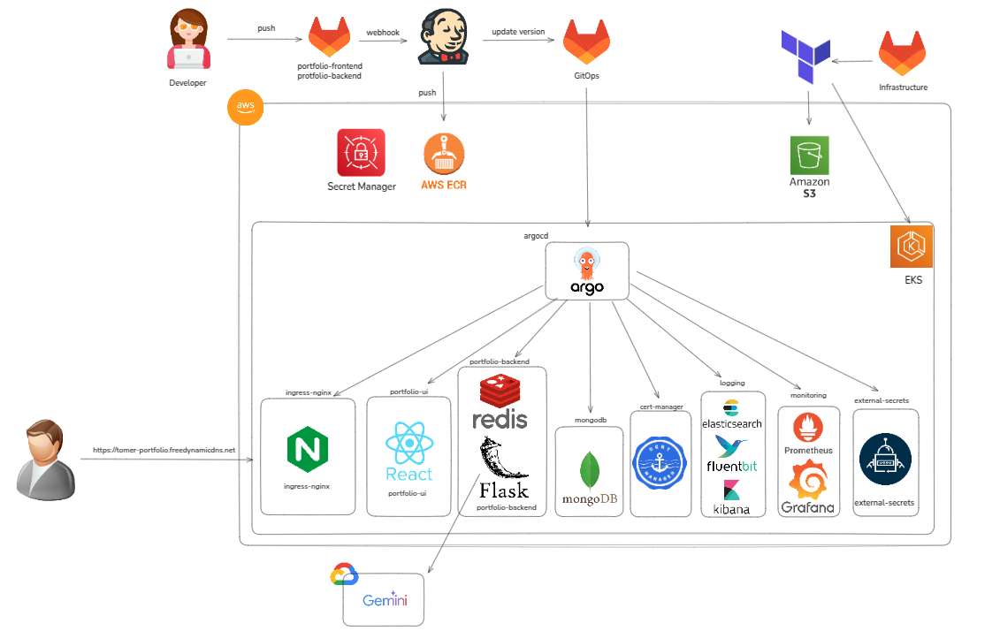
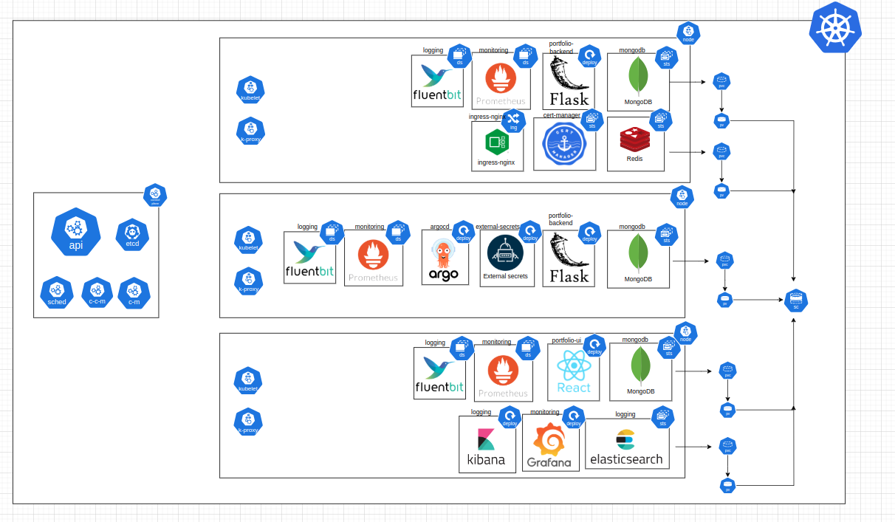
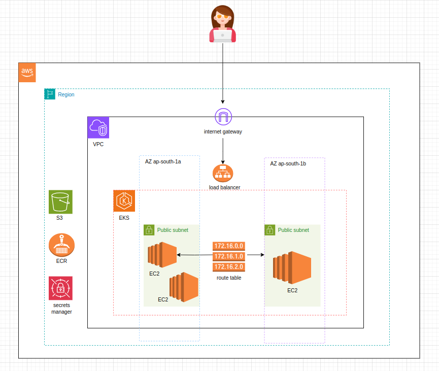
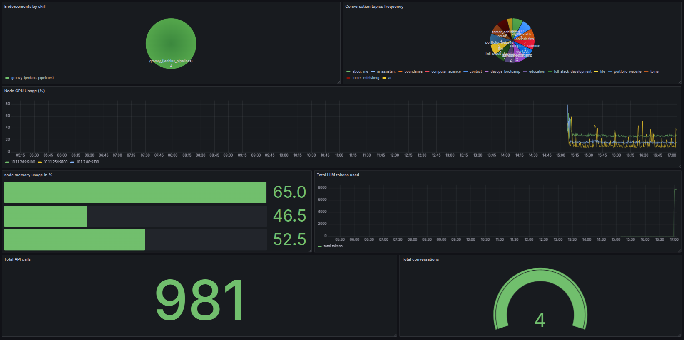
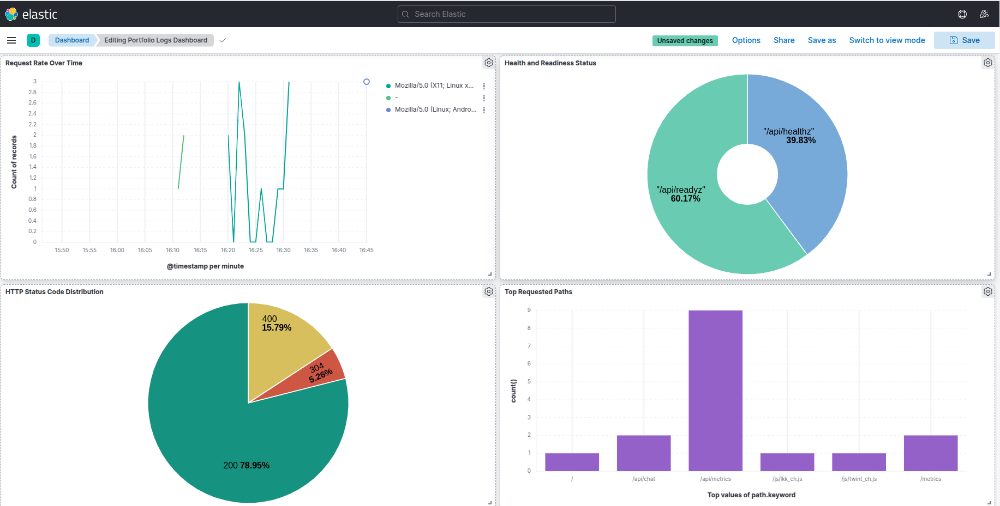

# Portfolio Monorepo

> A comprehensive full-stack portfolio application showcasing modern cloud-native architecture, DevOps practices, and infrastructure as code. The project demonstrates expertise in frontend development, backend services, infrastructure management, and GitOps practices.

## Table of Contents

- [Overview](#overview)
- [Architecture Diagrams](#architecture-diagrams)
- [Repository Structure](#repository-structure)
- [Technology Stack](#technology-stack)
- [Components](#components)
- [Getting Started](#getting-started)
- [Contributing](#contributing)
- [Contact](#contact)

## Overview

This monorepo contains all components of a modern, cloud-native portfolio application. It showcases best practices in software development, DevOps, and cloud architecture, featuring:

- Modern React frontend with TypeScript and Shadcn/UI
- Flask backend with AI/ML integration
- Infrastructure as Code with Terraform
- GitOps-based deployment with ArgoCD
- Comprehensive monitoring and logging
- Production-grade CI/CD pipelines

## Architecture Diagrams

### CI/CD Architecture


This diagram illustrates the continuous integration and deployment pipeline, showcasing:
- Code commit and review process
- Automated testing and quality checks
- Container image building and registry
- Deployment workflow with ArgoCD

### Kubernetes Architecture


This diagram shows the Kubernetes-based infrastructure, including:
- EKS cluster configuration
- Service mesh and networking
- Storage and persistence
- Monitoring and logging components

### Cloud Architecture


This diagram demonstrates the AWS cloud infrastructure, featuring:
- VPC and networking layout
- EKS cluster setup
- Load balancing and security
- Managed services integration

### Monitoring Architecture


This diagram illustrates the monitoring infrastructure, featuring:
- Prometheus metrics collection
- Grafana dashboards
- Service and infrastructure monitoring
- Performance metrics visualization

### Logging Architecture


This diagram shows the logging infrastructure, featuring:
- EFK Stack implementation
- Log aggregation with Fluent Bit
- Elasticsearch storage and indexing
- Kibana visualization and analysis

## Repository Structure

```
portfolio/
├── portfolio-frontend-public/  # Public frontend repository
├── portfolio-backend-public/   # Public backend repository
├── terraform-public/          # Public infrastructure repository
└── gitops-public/            # Public GitOps repository
```

## Technology Stack

| Category             | Technologies                                           |
|---------------------|-------------------------------------------------------|
| **Frontend**        | React, TypeScript, Shadcn/UI, Tailwind CSS            |
| **Backend**         | Python, Flask, MongoDB, Redis                         |
| **Infrastructure**  | AWS, Terraform, Kubernetes (EKS)                      |
| **CI/CD**          | Jenkins, ArgoCD, Docker                               |
| **Monitoring**     | Prometheus, Grafana                                   |
| **Logging**        | EFK Stack (Elasticsearch, Fluent Bit, Kibana)         |
| **Security**       | AWS IAM, RBAC, Security Groups                        |

## Components

### Frontend ([portfolio-frontend](https://gitlab.com/tomer-edelsberg/portfolio-frontend.git))
- Modern React application with TypeScript
- Component-driven development with Shadcn/UI
- Responsive design with Tailwind CSS
- Comprehensive testing with Vitest

### Backend ([portfolio-backend](https://gitlab.com/tomer-edelsberg/portfolio-backend.git))
- Flask-based REST API
- MongoDB for data persistence
- Redis for caching and rate limiting
- LLM integration with Google's Gemini 2.0
- Prometheus metrics export

### Infrastructure ([terraform](https://gitlab.com/tomer-edelsberg/infrastructure.git))
- Complete AWS infrastructure with Terraform
- EKS cluster provisioning
- Networking and security setup
- Managed services configuration

### GitOps ([gitops](https://gitlab.com/tomer-edelsberg/gitops.git))
- ArgoCD-based deployment
- Helm charts for application deployment
- Infrastructure applications management
- Kubernetes add-ons configuration

## Getting Started

1. **Clone the Repository**
```bash
git clone --recursive https://gitlab.com/tomer-edelsberg/Portfolio.git
cd Portfolio
```

2. **Infrastructure Setup**
```bash
cd terraform
terraform init
terraform apply
```

3. **Deploy Applications**
```bash
cd ../gitops
kubectl apply -f root-application.yaml
```

4. **Local Development**
```bash
# Frontend
cd portfolio-frontend
npm install
npm run dev

# Backend
cd portfolio-backend
python -m venv venv
source venv/bin/activate
pip install -r requirements.txt
python app.py
```

## Contributing

1. Fork the repository
2. Create your feature branch (`git checkout -b feature/AmazingFeature`)
3. Commit your changes (`git commit -m 'Add some AmazingFeature'`)
4. Push to the branch (`git push origin feature/AmazingFeature`)
5. Open a Pull Request

## Contact

Tomer Edelsberg
- Email: tomeredel@gmail.com
- LinkedIn: [Tomer Edelsberg](https://www.linkedin.com/in/tomer-edelsberg/)
- GitLab: [tomer-edelsberg](https://gitlab.com/tomer-edelsberg) 