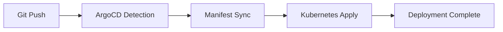

# Kubernetes Portfolio Project

> A comprehensive Kubernetes-based infrastructure deployment showcasing GitOps practices, infrastructure as code, and cloud-native technologies using ArgoCD and Helm.

## Table of Contents

- [Overview](#overview)
- [Architecture](#architecture)
- [Technology Stack](#technology-stack)
- [Repository Structure](#repository-structure)
- [Prerequisites](#prerequisites)
- [Getting Started](#getting-started)
- [CI/CD Pipeline](#cicd-pipeline)
- [Contributing](#contributing)
- [Contact](#contact)

## Overview

This project demonstrates modern DevOps practices and cloud-native architecture using Kubernetes. It implements a GitOps approach for managing infrastructure and applications, with ArgoCD handling the continuous deployment pipeline.

Key features:

- GitOps-based infrastructure management with ArgoCD
- Helm charts for package management and deployment
- Infrastructure as Code (IaC) principles
- Secure secrets management
- Scalable Kubernetes infrastructure

## Architecture

The project follows a GitOps architecture pattern where Git serves as the single source of truth for declarative infrastructure and application states. ArgoCD continuously monitors the repository and ensures the cluster state matches the desired state defined in Git.

## Technology Stack

| Category             | Technologies                                     |
| -------------------- | ----------------------------------------------- |
| **Infrastructure**   | Kubernetes                                      |
| **GitOps**          | ArgoCD                                          |
| **Package Manager**  | Helm                                           |
| **Version Control**  | Git                                            |
| **Configuration**    | YAML                                           |
| **Security**        | Kubernetes Secrets, ArgoCD RBAC                 |

## Repository Structure

```
project-root/
├── argocd/                    # ArgoCD configuration files
│   ├── infra-apps/           # Infrastructure applications
│   │   ├── cert-manager.yaml        # Certificate management
│   │   ├── elasticsearch-app.yaml   # Elasticsearch deployment
│   │   ├── external-secrets.yml     # External secrets management
│   │   ├── fluent-bit-app.yaml     # Log collection and forwarding
│   │   ├── ingress-nginx.yml       # Nginx ingress controller
│   │   ├── kibana-app.yaml         # Kibana visualization
│   │   └── kube-prometheus-stack.yaml # Monitoring stack
│   ├── application.yaml      # Main ArgoCD application config
│   ├── argocd-values.yaml    # ArgoCD configuration values
│   └── secret.yml            # Secure configurations
├── tomer-portfolio/          # Main application Helm chart
│   ├── templates/            # Helm templates
│   ├── charts/              # Dependent charts
│   │   ├── backend/         # Backend service chart
│   │   │   ├── templates/   # Backend templates
│   │   │   ├── Chart.yaml   # Backend chart definition
│   │   │   └── values.yaml  # Backend configuration
│   │   ├── frontend/        # Frontend service chart
│   │   │   ├── templates/   # Frontend templates
│   │   │   ├── Chart.yaml   # Frontend chart definition
│   │   │   └── values.yaml  # Frontend configuration
│   ├── values.yaml          # Default configuration values
│   └── Chart.yaml           # Chart definition
└── root-application.yaml     # Root application configuration
```

## Prerequisites

Requirements for deploying this project:

- Kubernetes cluster (v1.19+)
- Helm (v3+)
- ArgoCD installed on the cluster
- kubectl configured with cluster access
- Git

## Getting Started

### Infrastructure Setup

1. **Clone the Repository**

```bash
git https://gitlab.com/tomer-edelsberg/gitops.git
cd GitOps
```

2. **Install ArgoCD**

```bash
kubectl create namespace argocd
kubectl apply -n argocd -f https://raw.githubusercontent.com/argoproj/argo-cd/stable/manifests/install.yaml
```

3. **Deploy Root Application**

```bash
kubectl apply -f root-application.yaml
```

### Application Deployment

1. **Configure ArgoCD**

```bash
kubectl apply -f argocd/application.yaml
```

2. **Verify Deployment**

```bash
kubectl get applications -n argocd
```

Expected result: The ArgoCD applications should be synchronized and healthy.

## CI/CD Pipeline

The project implements a GitOps-based CI/CD pipeline using ArgoCD:



## Contributing

1. Fork the repository
2. Create your feature branch (`git checkout -b feature/AmazingFeature`)
3. Commit your changes (`git commit -m 'Add some AmazingFeature'`)
4. Push to the branch (`git push origin feature/AmazingFeature`)
5. Open a Pull Request

## Contact

Tomer Edelsberg - [LinkedIn](https://www.linkedin.com/in/tomer-edelsberg/) - tomeredel@gmail.com

Project Link: https://gitlab.com/tomer-edelsberg/gitops.git 