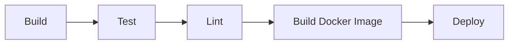

# Portfolio Frontend

> A modern, responsive portfolio frontend application built with React, TypeScript, and Shadcn/UI components. This project showcases a professional portfolio website with modern design principles and best development practices.

## Table of Contents

- [Overview](#overview)
- [Architecture](#architecture)
- [Technology Stack](#technology-stack)
- [Repository Structure](#repository-structure)
- [Prerequisites](#prerequisites)
- [Getting Started](#getting-started)
- [CI/CD Pipeline](#cicd-pipeline)
- [Contributing](#contributing)
- [Contact](#contact)

## Overview

This portfolio frontend project is a modern web application that demonstrates professional software development practices and modern web technologies. It's built with a focus on performance, maintainability, and user experience.

Key features:

- Modern React with TypeScript for type safety
- Component-driven development with Shadcn/UI
- Responsive design with Tailwind CSS
- Comprehensive testing setup with Vitest
- CI/CD pipeline with Jenkins
- Containerization with Docker
- Modern development tooling (Vite, ESLint, etc.)

## Architecture

The application follows a modern React architecture with the following key principles:

- Component-based architecture
- Type-safe development with TypeScript
- State management with React Query
- Routing with React Router
- Styling with Tailwind CSS and Shadcn/UI components
- Testing with Vitest and React Testing Library

## Technology Stack

| Category           | Technologies                                          |
|-------------------|------------------------------------------------------|
| **Frontend**      | React, TypeScript, Vite                              |
| **UI Components** | Shadcn/UI, Radix UI, Tailwind CSS                    |
| **State Management** | TanStack Query (React Query)                       |
| **Testing**       | Vitest, React Testing Library, Jest DOM              |
| **CI/CD**         | Jenkins                                              |
| **Containerization** | Docker, Docker Compose                            |
| **Code Quality**  | ESLint, TypeScript                                   |
| **Development**   | Vite, SWC                                            |

## Repository Structure

```
portfolio-frontend/
├── src/                # Source code
│   ├── components/     # Reusable UI components
│   ├── pages/         # Page components
│   ├── api/           # API integration
│   ├── hooks/         # Custom React hooks
│   ├── lib/           # Utility functions
│   └── __tests__/     # Test files
├── public/            # Static assets
├── tests/             # E2E and integration tests
├── docker/            # Docker configuration
├── .github/           # GitHub configuration
└── config files       # Various configuration files
```

## Prerequisites

- Node.js (v18 or higher)
- npm or yarn or bun
- Docker (for containerization)
- Git

## Getting Started

### Local Development

1. **Clone the repository**
```bash
git clone https://gitlab.com/tomer-edelsberg/portfolio-frontend.git
cd portfolio-frontend
```

2. **Install dependencies**
```bash
npm install
# or
yarn install
# or
bun install
```

3. **Start development server**
```bash
npm run dev
# or
yarn dev
# or
bun dev
```

### Docker Development

1. **Build the Docker image**
```bash
docker build -t portfolio-frontend .
```

2. **Run the container**
```bash
docker run -p 3000:80 portfolio-frontend
```

### Running Tests

```bash
# Run unit tests
npm run test

# Run tests with UI
npm run test:ui

# Run tests with coverage
npm run test:coverage

# Run tests in watch mode
npm run test:watch
```

## CI/CD Pipeline

The project uses Jenkins for continuous integration and deployment. The pipeline includes:



The pipeline is configured in the `jenkinsfile` at the root of the project.

## Contributing

1. Fork the repository
2. Create your feature branch (`git checkout -b feature/AmazingFeature`)
3. Commit your changes (`git commit -m 'Add some AmazingFeature'`)
4. Push to the branch (`git push origin feature/AmazingFeature`)
5. Open a Pull Request

## Contact

Tomer Edelsberg
- Email: tomeredel@gmail.com
- LinkedIn: [Tomer Edelsberg](https://www.linkedin.com/in/tomer-edelsberg/)

Project Link: https://gitlab.com/tomer-edelsberg/portfolio-frontend.git